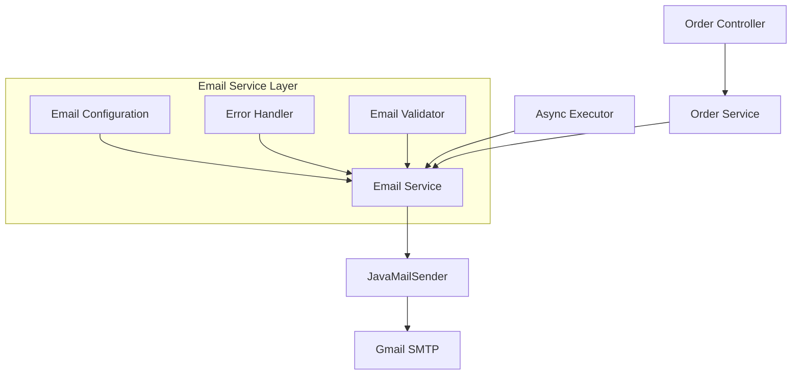

# Design Document: Order Email Fix

## Overview

This design addresses the non-functional email system in the SwiftCart e-commerce application. The application has existing email infrastructure using Spring Boot Mail with Gmail SMTP, but emails are not being sent during order placement. The solution involves diagnosing configuration issues, implementing robust error handling, adding email service validation, and ensuring reliable email delivery for both customer confirmations and admin notifications.

## Architecture

The email system follows a layered architecture:



### Key Components:
- **Order Service**: Triggers email sending after successful order creation
- **Email Service**: Handles all email operations with async processing
- **Configuration Validator**: Validates SMTP settings and credentials
- **Error Handler**: Manages email failures without affecting order processing
- **Async Executor**: Ensures non-blocking email operations

## Components and Interfaces

### EmailService Interface
```java
public interface EmailService {
    void sendOrderConfirmationToCustomer(Order order, User user);
    void sendOrderNotificationToAdmin(Order order, User user);
    boolean validateEmailConfiguration();
    void sendTestEmail(String recipient);
    EmailHealthStatus getEmailServiceHealth();
}
```

### EmailConfigurationValidator
```java
@Component
public class EmailConfigurationValidator {
    public ValidationResult validateSmtpConfiguration();
    public ValidationResult validateCredentials();
    public ValidationResult validateEmailAddresses();
}
```

### EmailHealthMonitor
```java
@Component
public class EmailHealthMonitor {
    public EmailHealthStatus checkEmailServiceHealth();
    public void recordEmailMetrics(EmailOperation operation, boolean success);
}
```

## Data Models

### EmailHealthStatus
```java
public class EmailHealthStatus {
    private boolean isHealthy;
    private String status;
    private List<String> issues;
    private LocalDateTime lastChecked;
    private EmailMetrics metrics;
}
```

### EmailMetrics
```java
public class EmailMetrics {
    private long totalEmailsSent;
    private long totalEmailsFailed;
    private double successRate;
    private Map<String, Integer> failureReasons;
}
```

### ValidationResult
```java
public class ValidationResult {
    private boolean isValid;
    private List<String> errors;
    private List<String> warnings;
    private Map<String, String> suggestions;
}
```

## Correctness Properties

*A property is a characteristic or behavior that should hold true across all valid executions of a system-essentially, a formal statement about what the system should do. Properties serve as the bridge between human-readable specifications and machine-verifiable correctness guarantees.*

### Property Reflection

After analyzing all acceptance criteria, several properties can be consolidated to eliminate redundancy:
- Properties 2.1 and 3.1 (email triggering) can be combined into one comprehensive property
- Properties 2.2, 2.3, 3.2, 3.3 (email content validation) can be combined into content completeness properties
- Properties 2.4 and 3.4 (error handling) can be combined into one error resilience property
- Properties 2.5 and 3.5 (async behavior) can be combined into one performance property

### Core Properties

**Property 1: SMTP Configuration Validation**
*For any* SMTP configuration (valid or invalid), the Email_Service validation should correctly identify connectivity and authentication status, returning appropriate success or failure results with specific error details.
**Validates: Requirements 1.1, 1.2, 1.3, 1.4**

**Property 2: Email Triggering Consistency**
*For any* order placement, both customer confirmation and admin notification emails should be triggered, regardless of order content or customer details.
**Validates: Requirements 2.1, 3.1**

**Property 3: Email Content Completeness**
*For any* order and associated customer data, generated emails should contain all required information including order details (ID, items, quantities, prices, total), customer information (name, address, date), and appropriate formatting.
**Validates: Requirements 2.2, 2.3, 3.2, 3.3**

**Property 4: Error Resilience**
*For any* email sending failure (customer or admin), the order creation process should complete successfully while logging appropriate error details.
**Validates: Requirements 2.4, 3.4**

**Property 5: Asynchronous Processing**
*For any* order placement, email sending operations should not block the order creation response, completing within acceptable time limits.
**Validates: Requirements 2.5, 3.5**

**Property 6: Configuration Validation at Startup**
*For any* application startup scenario, email configuration validation should occur and report all missing or invalid properties with specific remediation suggestions.
**Validates: Requirements 4.1, 4.2, 4.3**

**Property 7: Email Address Format Validation**
*For any* email address (valid or invalid format), the Email_Service should correctly validate the format and reject invalid addresses with clear error messages.
**Validates: Requirements 4.4**

**Property 8: Retry Logic with Exponential Backoff**
*For any* email service unavailability scenario, the retry mechanism should implement exponential backoff with appropriate intervals and maximum retry limits.
**Validates: Requirements 4.5**

**Property 9: Test Email Functionality**
*For any* test email request with valid configuration, a test message should be sent successfully, and with invalid configuration, appropriate error responses should be returned.
**Validates: Requirements 5.1, 5.2**

**Property 10: Logging and Metrics Tracking**
*For any* email operation (success or failure), appropriate log entries should be created and metrics should be updated to reflect the operation outcome and failure reasons.
**Validates: Requirements 5.3, 5.4**

**Property 11: Health Status Reporting**
*For any* email service health check, the reported status should accurately reflect the current configuration validity and service availability.
**Validates: Requirements 5.5**

## Error Handling

### Email Service Failures
- **SMTP Connection Failures**: Log detailed connection errors, implement retry logic with exponential backoff
- **Authentication Failures**: Provide clear credential error messages with remediation steps
- **Invalid Recipients**: Validate email addresses before sending, log validation failures
- **Content Generation Errors**: Handle template rendering failures gracefully

### Configuration Issues
- **Missing Properties**: Validate all required configuration at startup, provide specific missing property names
- **Invalid Values**: Validate property formats and ranges, suggest correct values
- **Credential Problems**: Test authentication during validation, provide clear error messages

### Resilience Patterns
- **Circuit Breaker**: Prevent cascading failures when email service is consistently unavailable
- **Graceful Degradation**: Continue order processing even when email service fails
- **Async Processing**: Ensure email failures don't impact order creation performance
- **Dead Letter Queue**: Store failed email attempts for later retry or manual intervention

## Testing Strategy

### Unit Testing Approach
- **Configuration Validation**: Test various configuration scenarios (valid, invalid, missing properties)
- **Email Content Generation**: Verify email templates render correctly with different order data
- **Error Handling**: Test failure scenarios and verify appropriate error responses
- **Address Validation**: Test email address format validation with various inputs

### Property-Based Testing Approach
- **Configuration Testing**: Generate random SMTP configurations and verify validation accuracy
- **Content Testing**: Generate random orders and verify email content completeness
- **Error Resilience**: Simulate various failure scenarios and verify system resilience
- **Performance Testing**: Verify async behavior and response time requirements

### Integration Testing
- **SMTP Connectivity**: Test actual email sending with test SMTP servers
- **Order Workflow**: Test complete order-to-email flow with real data
- **Error Recovery**: Test system behavior during email service outages
- **Health Monitoring**: Verify health check accuracy under various conditions

### Testing Configuration
- **Property Tests**: Minimum 100 iterations per property test
- **Test Tags**: Each property test tagged with **Feature: order-email-fix, Property {number}: {property_text}**
- **Mock Strategy**: Use real SMTP connections for integration tests, mocks for unit tests
- **Test Data**: Generate realistic order and customer data for comprehensive testing